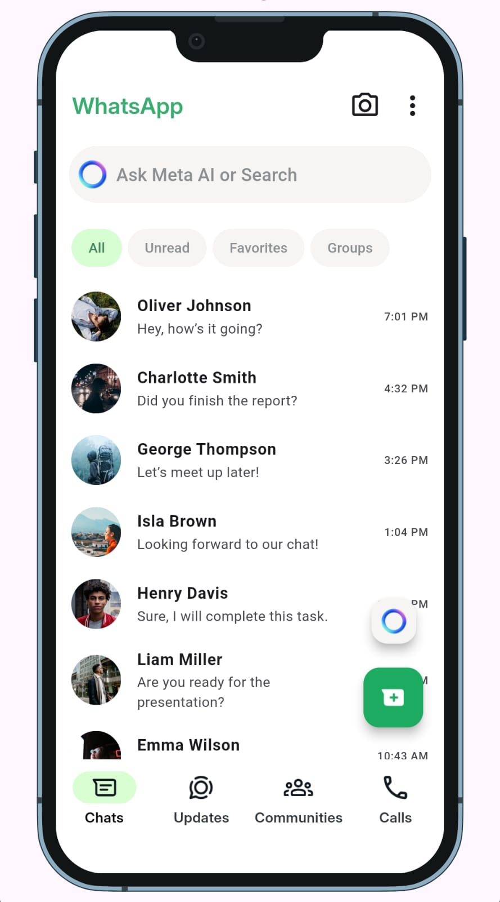

# WhatsApp Clone

## Overview

This project is a Flutter application that replicates the WhatsApp chats screen. It features a clean and user-friendly interface similar to the original WhatsApp chat interface, allowing users to view their chats, search for messages, and filter chats based on different categories.

## Features

- **App Bar**: Displays the title "WhatsApp" along with icons for camera and options.
- **Search Field**: A text field for users to search for messages or contacts, complete with a Meta icon.
- **Filter Chips**: Options to filter chats by categories such as "All," "Unread," "Favorites," and "Groups."
- **Chat List**: A scrollable list displaying chat items, including contact avatars, names, messages, and timestamps.
- **Floating Action Buttons**: Two buttons for additional actions, including starting a new chat and using Meta AI.
- **Custom Bottom Navigation Bar**: A navigation bar for switching between different sections of the app.

## Screenshot

Here's how the chats screen looks:

